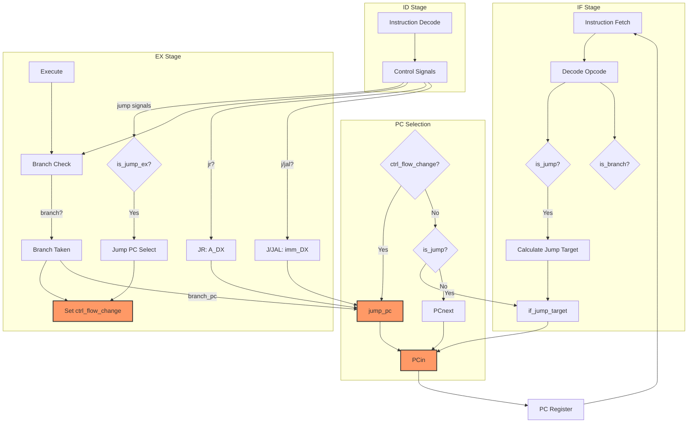

# How Your Jump Implementation Currently Works

Your jump implementation currently works through a multi-stage process:

## Current Jump Flow

1. **Jump Detection in IF stage**:
   - Detect jump instructions by examining the opcode of the current instruction (`is_j` and `is_jal` signals)
   - Combine these signals into `is_jump` for unconditional direct jumps

2. **Jump Target Calculation**:
   - For direct jumps (j/jal), you calculate the target by sign-extending the immediate field using `IF_IMMEXT` module
   - The sign extension shifts the bits appropriately for proper alignment

3. **Pipeline Control**:
   - Jump execution spans across stages with decisions made in both IF and EX stages
   - Direct jumps are handled early in IF
   - Register-based jumps (jr) and branches are handled later in EX

4. **PC Selection Logic**:
   - Priority-based multiplexing for next PC value:
     1. If there's a control flow change from EX stage (`ctrl_flow_change`), use `jump_pc`
     2. If there's a direct jump detected in IF (`is_jump`), use `if_jump_target`
     3. Otherwise, use sequential PC (`PCnext`)

5. **Jump/Branch Resolution in EX**:
   - Branch conditions are checked with ALU flags
   - Register-based jumps (jr) use the register value directly
   - `ctrl_flow_change` combines all redirection signals from EX

## Mermaid Diagram of Jump Implementation

## Summary of Current Implementation

Your jump implementation uses a hybrid approach:
- Early detection of direct jumps (j/jal) in IF stage
- Delayed resolution of register-based jumps (jr) and branches in EX stage
- Priority-based PC selection with control flow changes from EX having precedence
- The pipeline architecture means jumps introduce some delay, as the full resolution happens in EX stage

This approach gives you functional jumps, but there are trade-offs in terms of pipeline efficiency (potential bubbles) and jump latency (cycles needed to complete jumps).